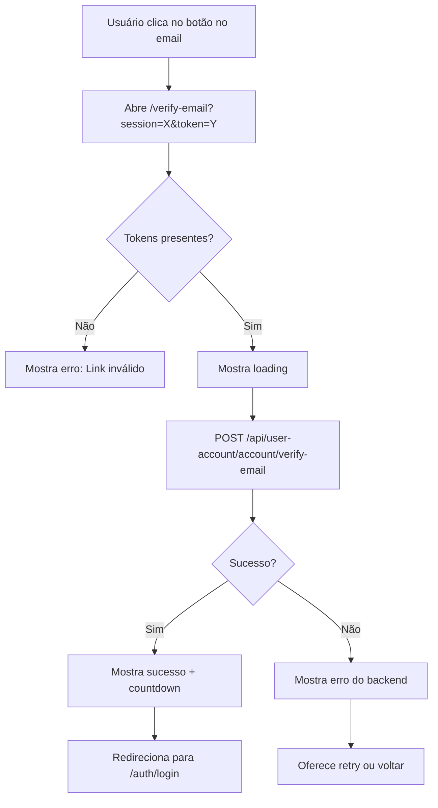
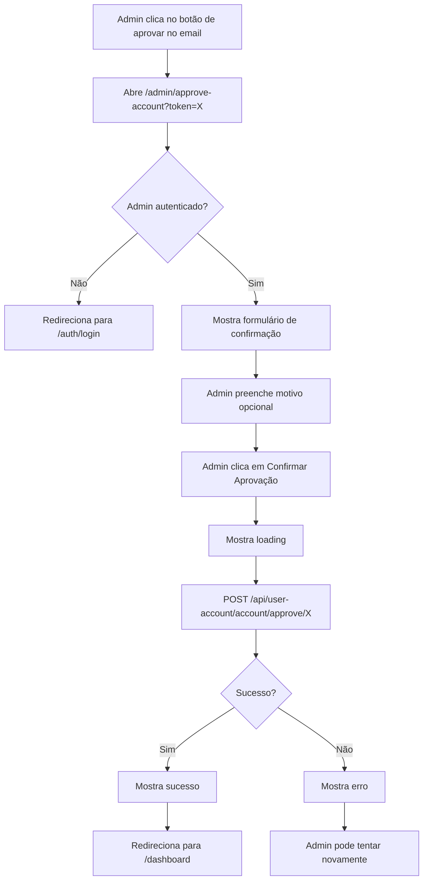

# Frontend Requirements: Email Verification & Admin Approval Pages

## 📋 Overview

Este documento descreve as páginas e rotas que o frontend precisa implementar para suportar os botões nos emails de verificação e aprovação administrativa.

Atualmente, os emails contêm instruções manuais e tokens visíveis. Com estas implementações, os usuários e administradores poderão clicar em botões nos emails que os levam diretamente ao frontend para completar as ações.

---

## 🎯 Objetivo

Criar páginas que:
1. **Recebem tokens via URL** (query parameters)
2. **Fazem chamadas automáticas à API** do backend
3. **Mostram feedback visual** de sucesso ou erro
4. **Redirecionam o usuário** após a ação

---

## 📍 Rotas a Implementar

### **1. Verificação de Email do Usuário**

#### **Rota:** `/verify-email`

**Query Parameters:**
- `session` - Session ID do registro
- `token` - Token de verificação

**Exemplo de URL:**
```
http://localhost:5173/verify-email?session=abc123&token=xyz789
```

**Endpoint Backend:**
```
POST /api/user-account/account/verify-email
Body: {
  "sessionId": "abc123",
  "verificationToken": "xyz789"
}
```

**Comportamento:**
1. Página carrega e extrai `session` e `token` da URL
2. Automaticamente faz POST para o endpoint backend
3. Mostra spinner/loading durante a requisição
4. Em caso de sucesso:
   - Mostra mensagem: "✅ Email verificado com sucesso!"
   - Redireciona para `/auth/login` após 3 segundos
5. Em caso de erro:
   - Mostra mensagem de erro do backend
   - Oferece botão para "Tentar Novamente" ou "Voltar ao Login"

**Possíveis Erros:**
- `2001` - Token inválido ou expirado
- `2002` - Session não encontrada
- `1001` - Email já verificado

---

### **2. Confirmação de Registro do Usuário**

#### **Rota:** `/confirm-registration`

**Query Parameters:**
- `session` - Session ID do registro
- `token` - Token de confirmação

**Exemplo de URL:**
```
http://localhost:5173/confirm-registration?session=abc123&token=xyz789
```

**Endpoint Backend:**
```
POST /api/user-account/account/confirm-email
Body: {
  "sessionId": "abc123",
  "verificationToken": "xyz789"
}
```

**Comportamento:**
1. Página carrega e extrai `session` e `token` da URL
2. Automaticamente faz POST para o endpoint backend
3. Mostra spinner/loading durante a requisição
4. Em caso de sucesso:
   - Mostra mensagem: "✅ Registro confirmado! Aguarde aprovação do administrador."
   - Redireciona para `/auth/login` após 3 segundos
5. Em caso de erro:
   - Mostra mensagem de erro do backend
   - Oferece botão para voltar ao login

**Possíveis Erros:**
- `2001` - Token inválido ou expirado
- `2002` - Session não encontrada

---

### **3. Verificação de Email do Afiliado**

#### **Rota:** `/verify-affiliate-email`

**Query Parameters:**
- `session` - Session ID do registro de afiliado
- `token` - Token de verificação

**Exemplo de URL:**
```
http://localhost:5173/verify-affiliate-email?session=abc123&token=xyz789
```

**Endpoint Backend:**
```
POST /api/user-account/affiliate/verify-email
Body: {
  "sessionId": "abc123",
  "verificationToken": "xyz789"
}
```

**Comportamento:**
Similar à verificação de email do usuário, mas específico para afiliados.

---

### **4. Aprovação de Conta pelo Admin**

#### **Rota:** `/admin/approve-account`

**Query Parameters:**
- `token` - Token de aprovação

**Exemplo de URL:**
```
http://localhost:5173/admin/approve-account?token=approval-token-xyz789
```

**Endpoint Backend:**
```
POST /api/user-account/account/approve/{token}
Body: {
  "action": "approve",
  "reason": "Aprovado pelo administrador" // Opcional
}
```

**Comportamento:**
1. Página carrega e extrai `token` da URL
2. **Verifica se usuário está autenticado e é admin** (importante!)
3. Mostra informações do registro (se possível buscar do backend)
4. Mostra campo opcional para "Motivo da Aprovação"
5. Mostra botão "Confirmar Aprovação"
6. Ao clicar:
   - Faz POST para o endpoint backend com o token
   - Mostra spinner/loading
7. Em caso de sucesso:
   - Mostra mensagem: "✅ Conta aprovada com sucesso!"
   - Redireciona para `/dashboard` ou lista de aprovações pendentes
8. Em caso de erro:
   - Mostra mensagem de erro
   - Oferece opção de voltar

**Possíveis Erros:**
- `3001` - Sem permissão (não é admin)
- `2001` - Token inválido ou expirado
- `1004` - Conta já foi processada (aprovada/rejeitada)

---

### **5. Rejeição de Conta pelo Admin**

#### **Rota:** `/admin/reject-account`

**Query Parameters:**
- `token` - Token de rejeição

**Exemplo de URL:**
```
http://localhost:5173/admin/reject-account?token=rejection-token-xyz789
```

**Endpoint Backend:**
```
POST /api/user-account/account/approve/{token}
Body: {
  "action": "reject",
  "reason": "Motivo da rejeição" // OBRIGATÓRIO para rejeição
}
```

**Comportamento:**
1. Página carrega e extrai `token` da URL
2. **Verifica se usuário está autenticado e é admin**
3. Mostra informações do registro
4. **Mostra campo OBRIGATÓRIO** para "Motivo da Rejeição"
5. Mostra botão "Confirmar Rejeição" (estilo vermelho/warning)
6. Ao clicar:
   - Valida que o motivo foi preenchido
   - Faz POST para o endpoint backend
   - Mostra spinner/loading
7. Em caso de sucesso:
   - Mostra mensagem: "❌ Conta rejeitada. Usuário será notificado."
   - Redireciona para `/dashboard` ou lista de aprovações
8. Em caso de erro:
   - Mostra mensagem de erro

**Validação Frontend:**
- Campo "Motivo" deve ter no mínimo 10 caracteres
- Mostrar mensagem se campo estiver vazio ao tentar submeter

---

### **6. Aprovação de Afiliado pelo Admin**

#### **Rota:** `/admin/approve-affiliate`

**Query Parameters:**
- `token` - Token de aprovação do afiliado

**Exemplo de URL:**
```
http://localhost:5173/admin/approve-affiliate?token=affiliate-approval-xyz789
```

**Endpoint Backend:**
```
POST /api/user-account/affiliate/approve/{token}
Body: {
  "action": "approve",
  "reason": "Aprovado pelo administrador" // Opcional
}
```

**Comportamento:**
Similar à aprovação de conta, mas específico para afiliados.

---

### **7. Rejeição de Afiliado pelo Admin**

#### **Rota:** `/admin/reject-affiliate`

**Query Parameters:**
- `token` - Token de rejeição do afiliado

**Exemplo de URL:**
```
http://localhost:5173/admin/reject-affiliate?token=affiliate-rejection-xyz789
```

**Endpoint Backend:**
```
POST /api/user-account/affiliate/approve/{token}
Body: {
  "action": "reject",
  "reason": "Motivo da rejeição" // OBRIGATÓRIO
}
```

**Comportamento:**
Similar à rejeição de conta, mas específico para afiliados.

---

## 🎨 Componentes Sugeridos

### **1. VerificationPage Component (Genérico)**

Componente reutilizável para todas as verificações:

```typescript
interface VerificationPageProps {
  title: string;
  successMessage: string;
  errorMessage?: string;
  redirectTo: string;
  apiEndpoint: string;
  extractParams: (searchParams: URLSearchParams) => any;
}
```

**Exemplo de uso:**

```tsx
// VerifyEmailPage.tsx
<VerificationPage
  title="Verificação de Email"
  successMessage="Email verificado com sucesso!"
  redirectTo="/auth/login"
  apiEndpoint="/api/user-account/account/verify-email"
  extractParams={(params) => ({
    sessionId: params.get('session'),
    verificationToken: params.get('token')
  })}
/>
```

---

### **2. AdminApprovalPage Component**

Componente específico para aprovações/rejeições administrativas:

```tsx
interface AdminApprovalPageProps {
  type: 'account' | 'affiliate';
  action: 'approve' | 'reject';
  token: string;
}
```

**Features:**
- Campo de "Motivo" (opcional para aprovação, obrigatório para rejeição)
- Validação de autenticação admin
- Confirmação antes de submeter
- Feedback visual claro (verde para approve, vermelho para reject)

---

## 🔐 Segurança e Validações

### **Validações Necessárias:**

1. **Verificar se os tokens existem na URL**
   ```typescript
   if (!session || !token) {
     showError('Link inválido ou incompleto');
     return;
   }
   ```

2. **Para páginas de admin: verificar autenticação**
   ```typescript
   if (!user || !user.isAdmin) {
     navigate('/auth/login');
     return;
   }
   ```

3. **Validar resposta da API**
   ```typescript
   if (response.code) {
     // Backend retornou erro
     showError(response.message);
   }
   ```

4. **Timeout de requisição**
   - Definir timeout de 10 segundos para chamadas API
   - Mostrar erro se timeout expirar

---

## 📊 Estados da UI

### **Estados a Implementar:**

1. **Loading** - Enquanto faz chamada API
   ```tsx
   {isLoading && <Spinner text="Processando..." />}
   ```

2. **Success** - Ação completada com sucesso
   ```tsx
   {isSuccess && (
     <SuccessMessage>
       ✅ {successMessage}
       <p>Redirecionando em {countdown} segundos...</p>
     </SuccessMessage>
   )}
   ```

3. **Error** - Erro na ação
   ```tsx
   {error && (
     <ErrorMessage>
       ❌ {error.message}
       <Button onClick={retry}>Tentar Novamente</Button>
     </ErrorMessage>
   )}
   ```

4. **Idle** - Estado inicial (apenas para páginas de admin com formulário)

---

## 🔄 Fluxo de Exemplo: Verificação de Email



---

## 🔄 Fluxo de Exemplo: Aprovação Admin



---

## 📝 Checklist de Implementação

### **Páginas de Verificação de Usuário:**
- [ ] `/verify-email` - Verificação de email do usuário
- [ ] `/confirm-registration` - Confirmação de registro
- [ ] `/verify-affiliate-email` - Verificação de email do afiliado

### **Páginas de Admin:**
- [ ] `/admin/approve-account` - Aprovação de conta
- [ ] `/admin/reject-account` - Rejeição de conta
- [ ] `/admin/approve-affiliate` - Aprovação de afiliado
- [ ] `/admin/reject-affiliate` - Rejeição de afiliado

### **Componentes Reutilizáveis:**
- [ ] `VerificationPage` - Componente genérico para verificações
- [ ] `AdminApprovalPage` - Componente genérico para aprovações/rejeições
- [ ] `LoadingSpinner` - Spinner durante requisições
- [ ] `SuccessMessage` - Mensagem de sucesso com countdown
- [ ] `ErrorMessage` - Mensagem de erro com retry

### **Validações:**
- [ ] Validar presença de tokens na URL
- [ ] Validar autenticação admin (rotas `/admin/*`)
- [ ] Validar campo "Motivo" em rejeições (mínimo 10 caracteres)
- [ ] Timeout de requisições (10 segundos)

### **UX:**
- [ ] Countdown automático antes de redirecionar (3 segundos)
- [ ] Botão "Tentar Novamente" em erros
- [ ] Confirmação antes de ações críticas (aprovar/rejeitar)
- [ ] Feedback visual claro (cores, ícones)

---

## 🧪 Testes Sugeridos

### **1. Teste de URL Inválida**
- Acessar `/verify-email` sem parâmetros
- Acessar `/verify-email?session=only` (falta token)
- Verificar se mostra erro apropriado

### **2. Teste de Token Expirado**
- Usar token que já expirou
- Verificar se backend retorna erro 2001
- Verificar se frontend mostra mensagem clara

### **3. Teste de Autenticação Admin**
- Acessar `/admin/approve-account` sem estar logado
- Verificar se redireciona para login
- Acessar como usuário não-admin
- Verificar se mostra erro de permissão

### **4. Teste de Fluxo Completo**
- Criar registro de teste
- Receber email (via Mailtrap ou similar)
- Clicar no botão do email
- Verificar se ação completa corretamente
- Verificar se redireciona apropriadamente

---

## 🎨 Exemplos de UI (Referência)

### **Página de Verificação (Loading)**
```
┌────────────────────────────────────┐
│  🔄 Verificando seu email...       │
│                                    │
│  [====    ] 60%                   │
│                                    │
│  Aguarde um momento...            │
└────────────────────────────────────┘
```

### **Página de Verificação (Sucesso)**
```
┌────────────────────────────────────┐
│  ✅ Email verificado com sucesso!  │
│                                    │
│  Sua conta foi verificada.        │
│  Aguarde aprovação do admin.      │
│                                    │
│  Redirecionando em 3s...          │
│                                    │
│  [Ir para Login Agora]            │
└────────────────────────────────────┘
```

### **Página de Verificação (Erro)**
```
┌────────────────────────────────────┐
│  ❌ Erro na verificação            │
│                                    │
│  Token inválido ou expirado.      │
│                                    │
│  [Tentar Novamente] [Voltar]      │
└────────────────────────────────────┘
```

### **Página de Aprovação Admin**
```
┌────────────────────────────────────┐
│  👤 Aprovar Registro               │
│                                    │
│  Nome: João Silva                 │
│  Email: joao@example.com          │
│  Data: 01/12/2025                 │
│                                    │
│  Motivo (opcional):               │
│  ┌──────────────────────────────┐ │
│  │ Documentação válida          │ │
│  └──────────────────────────────┘ │
│                                    │
│  [✅ Aprovar] [❌ Cancelar]        │
└────────────────────────────────────┘
```

---

## 📚 Documentação de Referência

### **Endpoints Backend:**
- Ver `FRONTEND_INTEGRATION_GUIDE.md` para documentação completa da API
- Ver `ERROR_HANDLING_FRONTEND_GUIDE.md` para códigos de erro

### **Códigos de Erro Comuns:**
- `1001` - Email já verificado
- `1003` - Credenciais inválidas
- `1004` - Conta já processada
- `2001` - Token inválido ou expirado
- `2002` - Session não encontrada
- `3001` - Sem permissão (não é admin)

---

## 🚀 Próximos Passos

1. **Implementar as 7 rotas** listadas acima
2. **Criar componentes reutilizáveis** (VerificationPage, AdminApprovalPage)
3. **Testar cada fluxo** com dados de desenvolvimento
4. **Integrar com sistema de autenticação** (verificar se é admin)
5. **Notificar o backend** quando implementação estiver completa
6. **Backend atualizará os templates de email** com os botões funcionais

---

## ❓ Dúvidas Frequentes

### **1. O que fazer se o token expirar?**
- Mostrar mensagem clara: "Token expirado. Solicite um novo link."
- Oferecer botão para voltar ao login ou solicitar novo email

### **2. Preciso armazenar os tokens?**
- **Não!** Os tokens vêm na URL e são usados imediatamente
- Não armazene tokens em localStorage ou sessionStorage

### **3. Como testar sem emails reais?**
- Use Mailtrap.io ou similar para capturar emails em desenvolvimento
- Ou copie manualmente a URL gerada pelo backend nos logs

### **4. As páginas de admin precisam de layout especial?**
- Recomendado usar o `DashboardLayout` existente
- Adicionar indicador visual de que é área administrativa

### **5. O que fazer se o usuário não for admin?**
- Redirecionar para `/auth/login`
- Ou mostrar erro 403 (Forbidden) e botão para voltar

---

## 📞 Contato

Se tiver dúvidas sobre os endpoints, estrutura de dados, ou comportamento esperado:
- Consultar `FRONTEND_INTEGRATION_GUIDE.md`
- Consultar `ERROR_HANDLING_FRONTEND_GUIDE.md`
- Testar endpoints via Swagger: `http://localhost:3000/api`

---

**Data do Documento:** 01/12/2025  
**Versão:** 1.0  
**Status:** Aguardando Implementação Frontend
