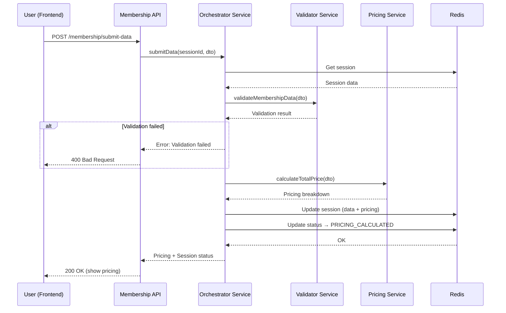
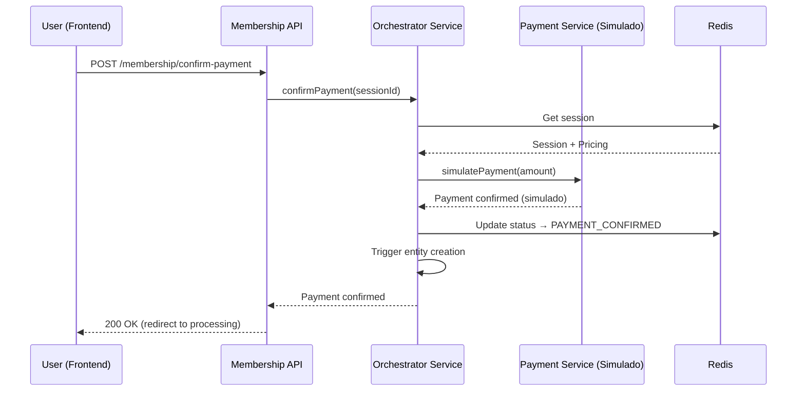
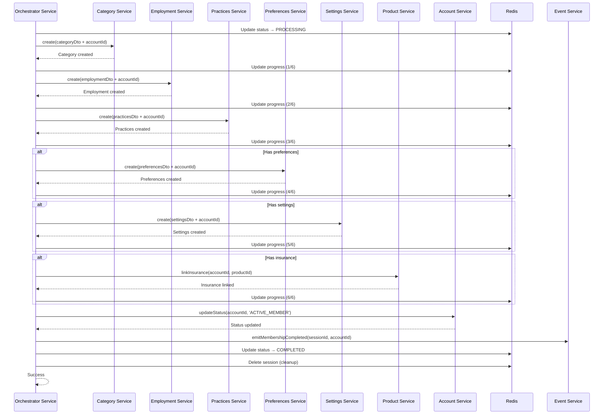

# Membership Orchestrator - Discussão e Decisões de Implementação

**Data:** 6-8 de Dezembro de 2025  
**Participantes:** Time de Backend  
**Status:** Planejamento Concluído - Pronto para Implementação

---

## Índice

1. [Contexto da Discussão](#contexto-da-discussão)
2. [Decisões Arquiteturais Principais](#decisões-arquiteturais-principais)
3. [Diferenças vs Account Orchestrator](#diferenças-vs-account-orchestrator)
4. [Fluxo de Trabalho Detalhado](#fluxo-de-trabalho-detalhado)
5. [Questões Respondidas](#questões-respondidas)
6. [Estrutura de Dados](#estrutura-de-dados)
7. [Próximos Passos](#próximos-passos)

---

## Contexto da Discussão

### Objetivo

Implementar o **Membership Orchestrator** seguindo o padrão arquitetural do **Account Orchestrator**, mas adaptado para o contexto de usuários já autenticados que desejam se tornar membros da OSOT.

### Motivação

- **Account Orchestrator** lida com registro de novos usuários (não autenticados)
- **Membership Orchestrator** lida com usuários existentes que querem virar membros
- Processo envolve múltiplas entidades (5 principais + produtos opcionais)
- Requer coordenação de pagamento, produtos, e atualização de status

### Análise Base

Analisamos completamente a estrutura do `account-orchestrator` para replicar o padrão:
- **Enums:** Estados e tipos de erro de validação
- **DTOs:** Agregação de múltiplas entidades, sessão, progresso, resposta
- **Services:** Orquestração principal, validação, workflow de email
- **Events:** Ciclo de vida observável (initiated, validated, approved, completed, failed)
- **Validators:** Validação cross-entity (contato, educação, geografia, identidade)
- **Repository:** Gerenciamento de sessão Redis
- **Mappers:** Transformações de DTO

---

## Decisões Arquiteturais Principais

### 1. ✅ Autenticação Obrigatória

**Decisão:** Membership só pode ser criado por usuários autenticados com conta ativa.

**Justificativa:**
```
- Account já existe no Dataverse
- JWT contém accountId/accountGuid
- Não precisa passar accountId em DTO
- Validação de account status antes de iniciar
```

**Implementação:**
```typescript
@UseGuards(JwtAuthGuard)
@Post('/membership/initiate')
async initiateMembership(@Request() req: AuthenticatedRequest) {
  const accountId = req.user.userId; // Do JWT
  const accountGuid = req.user.userGuid; // Do JWT
  
  // Validar se account está ACTIVE
  const accountStatus = await this.accountService.getStatus(accountId);
  if (accountStatus !== 'ACTIVE') {
    throw new ForbiddenException('Account must be active');
  }
  
  // Iniciar workflow do orchestrator
  return this.membershipOrchestrator.initiate(accountId);
}
```

---

### 2. ✅ Processo Manual (User-Triggered)

**Decisão:** Usuário clica em "Become a Member" para iniciar o processo.

**Justificativa:**
```
- Não é automático após account creation
- Usuário pode ter account SEM membership
- Membership tem custo (fee + insurance + donation)
- Requer dados adicionais (employment, practices)
- Usuário precisa aceitar termos de membership
```

**UI Flow:**
```
Dashboard → "Become a Member" Button → 
GET /membership/prepare (busca dados) → 
Frontend Form → 
POST /membership/submit → 
Pricing Calculation → 
Payment Screen → 
POST /membership/confirm-payment → 
Entity Creation → 
Confirmation Screen
```

---

### 3. ✅ Redis para Sessão Temporária

**Decisão:** Todo o processo ocorre dentro de uma sessão Redis antes de criar registros no Dataverse.

**Justificativa:**
```
- Evita dados incompletos no Dataverse
- Permite retomada do processo se interrompido
- Suporta delay de pagamento
- Facilita rollback em caso de erro
- TTL de 48 horas (maior que account orchestrator)
```

**Redis Keys:**
```typescript
const REDIS_KEYS = {
  SESSION: 'membership-orchestrator:session:{sessionId}',
  ACCOUNT: 'membership-orchestrator:account:{sessionId}',
  PRICING: 'membership-orchestrator:pricing:{sessionId}',
  PRODUCTS: 'membership-orchestrator:products:{sessionId}',
  PAYMENT: 'membership-orchestrator:payment:{sessionId}',
  PROGRESS: 'membership-orchestrator:progress:{sessionId}',
};

const SESSION_TTL = 48 * 60 * 60; // 48 horas
```

---

### 4. ❌ SEM DTOs de Integração Account

**Decisão:** NÃO criar DTOs como `CreateMembershipCategoryForAccountDto`.

**Justificativa:**
```
- Account JÁ existe (diferente do account orchestrator)
- AccountId disponível via JWT
- Cada entidade já tem CreateDto próprio funcional
- Entidades lidam com @odata.bind internamente
- Evita duplicação de código
```

**Contraste:**
```typescript
// ❌ Account Orchestrator (novo usuário - precisa de DTO integrado)
CompleteUserRegistrationDto {
  account: CreateAccountDto;
  address: CreateAddressForAccountDto;  // ← Precisa de DTO especial
  contact: CreateContactForAccountDto;  // ← Precisa de DTO especial
  // ...
}

// ✅ Membership Orchestrator (usuário existente - usa DTOs direto)
CompleteMembershipRegistrationDto {
  category: CreateMembershipCategoryDto;     // ← DTO normal
  employment: CreateMembershipEmploymentDto; // ← DTO normal
  practices: CreateMembershipPracticesDto;   // ← DTO normal
  // accountId vem do JWT, não do DTO
}
```

---

### 5. ✅ Pre-Fetch de Dados no Início

**Decisão:** Fazer GET inicial que busca Account + Products e armazena tudo no Redis.

**Justificativa:**
```
- Frontend precisa mostrar dados do usuário
- Produtos (Insurance + Donation) listados para seleção
- Reduz chamadas ao Dataverse durante o processo
- Melhora performance
- Dados consistentes durante toda a sessão
```

**Endpoint:**
```typescript
@Get('/membership/prepare')
async prepareMembership(@Request() req: AuthenticatedRequest) {
  const sessionId = generateSessionId();
  
  // 1. Buscar dados do Account
  const account = await this.accountService.findOne(req.user.userId);
  
  // 2. Buscar produtos Insurance
  const insurance = await this.productService.findByCategory('INSURANCE');
  
  // 3. Buscar produtos Donation
  const donations = await this.productService.findByCategory('DONATION');
  
  // 4. Armazenar tudo no Redis
  await this.redis.set(
    `membership-orchestrator:account:${sessionId}`,
    JSON.stringify(account),
    SESSION_TTL
  );
  
  await this.redis.set(
    `membership-orchestrator:products:${sessionId}`,
    JSON.stringify({ insurance, donations }),
    SESSION_TTL
  );
  
  // 5. Retornar para frontend
  return {
    sessionId,
    account: this.mapAccountToResponse(account),
    products: { insurance, donations },
    membershipYear: new Date().getFullYear().toString(),
    expiresAt: new Date(Date.now() + SESSION_TTL * 1000),
  };
}
```

---

### 6. ✅ Seleção de Produtos (Insurance + Donation)

**Decisão:** Usuário pode selecionar 0 ou 1 Insurance + 0 ou N Donations.

**Justificativa:**
```
- Insurance é opcional (não obrigatório para todos os tipos de membership)
- Donation é completamente opcional
- Usuário escolhe durante o processo
- Preço é somado ao total
```

**DTO:**
```typescript
class ProductSelectionDto {
  @IsOptional()
  @ValidateNested()
  @Type(() => InsuranceSelectionDto)
  insurance?: InsuranceSelectionDto;
  
  @IsOptional()
  @IsArray()
  @ValidateNested({ each: true })
  @Type(() => DonationSelectionDto)
  donations?: DonationSelectionDto[];
}

class InsuranceSelectionDto {
  @IsString()
  @IsNotEmpty()
  productId: string; // osot-prod-0000001
  
  @IsNumber()
  @Min(0)
  price: number;
}

class DonationSelectionDto {
  @IsString()
  @IsNotEmpty()
  productId: string;
  
  @IsNumber()
  @Min(1)
  amount: number; // Usuário define o valor
}
```

**Busca de Produtos:**
```typescript
// No initiate, buscar produtos disponíveis
const insuranceProducts = await this.productService.findAll({
  category: ProductCategory.INSURANCE,
  status: ProductStatus.AVAILABLE,
});

const donationProducts = await this.productService.findAll({
  category: ProductCategory.DONATION,
  status: ProductStatus.AVAILABLE,
});
```

---

### 7. ✅ Cálculo de Preço via `membership-settings`

**Decisão:** Usar a entidade `membership-settings` para calcular o fee de membership.

**Justificativa:**
```
- membership-settings tem regras de precificação
- Considera: categoria, ano, datas de início/fim
- Pro-rata se entrou no meio do ano
- Baseado em tabela do Dataverse
```

**Localização:** `src/classes/membership/membership-settings`

**Cálculo Simplificado:**
```typescript
async calculateTotalPrice(dto: CompleteMembershipRegistrationDto) {
  // 1. Fee base do membership (da tabela membership-settings)
  const membershipFee = await this.membershipSettingsService.calculateFee({
    category: dto.category.osot_Membership_Category,
    year: dto.category.osot_Membership_Year,
    accountGroup: this.accountGroup, // Do account
    startDate: new Date(),
  });
  
  // 2. Insurance (se selecionado)
  const insuranceFee = dto.productSelection?.insurance?.price || 0;
  
  // 3. Donations (soma de todos)
  const donationTotal = dto.productSelection?.donations?.reduce(
    (sum, d) => sum + d.amount, 
    0
  ) || 0;
  
  // 4. Total
  const total = membershipFee + insuranceFee + donationTotal;
  
  return {
    membershipFee,
    insuranceFee,
    donationTotal,
    total,
    currency: 'CAD',
  };
}
```

**Nota:** Regras detalhadas de cálculo serão implementadas quando chegarmos nessa fase.

---

### 8. ✅ Payment como Etapa Simulada (Futuro: PayPal)

**Decisão:** Por enquanto, payment é simulado/ignorado. No futuro, integração PayPal.

**Justificativa:**
```
- PayPal ainda não integrado
- Foco inicial é fluxo de entidades
- Payment será adicionado em fase posterior
- Por enquanto: auto-confirm
```

**Comportamento Atual:**
```typescript
async processPayment(sessionId: string, paymentDto: PaymentDto) {
  // Simulação: Auto-confirmar
  await this.updateSessionStatus(sessionId, 'PAYMENT_CONFIRMED');
  
  // Disparar criação de entidades
  await this.createMembershipEntities(sessionId);
  
  return { status: 'CONFIRMED', message: 'Payment simulated (auto-confirmed)' };
}
```

**Futuro (PayPal):**
```typescript
async processPayment(sessionId: string, paymentDto: PayPalPaymentDto) {
  // 1. Criar ordem no PayPal
  const order = await this.paypalService.createOrder({
    amount: paymentDto.amount,
    currency: 'CAD',
  });
  
  // 2. Armazenar paypalOrderId no Redis
  await this.redis.set(
    `membership-orchestrator:payment:${sessionId}`,
    JSON.stringify({ paypalOrderId: order.id }),
    SESSION_TTL
  );
  
  // 3. Retornar para frontend completar no PayPal
  return { paypalOrderId: order.id, approvalUrl: order.approvalUrl };
}

// Webhook do PayPal confirma pagamento
async handlePayPalWebhook(event: PayPalWebhookEvent) {
  if (event.event_type === 'PAYMENT.CAPTURE.COMPLETED') {
    const sessionId = await this.findSessionByPayPalOrderId(event.orderId);
    await this.updateSessionStatus(sessionId, 'PAYMENT_CONFIRMED');
    await this.createMembershipEntities(sessionId);
  }
}
```

---

### 9. ❌ SEM Aprovação de Administrador

**Decisão:** NÃO há estado `PENDING_APPROVAL` ou aprovação manual.

**Justificativa:**
```
- Payment é a aprovação
- Se pagamento processou = membership aprovado
- Reduz tempo de espera do usuário
- Diferente do account orchestrator que precisa de aprovação manual
```

**State Machine:**
```
INITIATED → COLLECTING_DATA → PRICING_CALCULATED → 
PAYMENT_PENDING → PAYMENT_CONFIRMED → PROCESSING → 
COMPLETED / FAILED

// ❌ NÃO TEM: PENDING_APPROVAL, APPROVED, REJECTED
```

---

### 10. ✅ Ordem de Criação de Entidades (CRÍTICA)

**Decisão:** Entidades DEVEM ser criadas nesta ordem exata.

**Justificativa:**
```
- membership-category determina tipo e workflow
- employment/practices são required
- preferences/settings são optional
- product-insurance por último (linking)
```

**Sequência:**
```typescript
const ENTITY_CREATION_ORDER = [
  'membership-category',      // 1️⃣ OBRIGATÓRIO - Define tipo
  'membership-employment',    // 2️⃣ OBRIGATÓRIO - Status profissional
  'membership-practices',     // 3️⃣ OBRIGATÓRIO - Detalhes de prática
  'membership-preferences',   // 4️⃣ OPCIONAL - Preferências
  'membership-settings',      // 5️⃣ OPCIONAL - Configurações
  'product-insurance',        // 6️⃣ OPCIONAL - Link de produto (se selecionado)
] as const;
```

**Implementação:**
```typescript
async createMembershipEntities(sessionId: string) {
  const session = await this.getSession(sessionId);
  const progress = { completed: [], failed: [], current: null };
  
  try {
    // 1. Category (OBRIGATÓRIO)
    progress.current = 'membership-category';
    const category = await this.categoryService.create({
      ...session.data.category,
      accountId: session.accountId, // Do JWT
    });
    progress.completed.push('membership-category');
    
    // 2. Employment (OBRIGATÓRIO)
    progress.current = 'membership-employment';
    const employment = await this.employmentService.create({
      ...session.data.employment,
      accountId: session.accountId,
    });
    progress.completed.push('membership-employment');
    
    // 3. Practices (OBRIGATÓRIO)
    progress.current = 'membership-practices';
    const practices = await this.practicesService.create({
      ...session.data.practices,
      accountId: session.accountId,
    });
    progress.completed.push('membership-practices');
    
    // 4. Preferences (OPCIONAL - não falha workflow se der erro)
    if (session.data.preferences) {
      try {
        progress.current = 'membership-preferences';
        await this.preferencesService.create({
          ...session.data.preferences,
          accountId: session.accountId,
        });
        progress.completed.push('membership-preferences');
      } catch (error) {
        this.logger.warn('Preferences creation failed (optional)', error);
      }
    }
    
    // 5. Settings (OPCIONAL)
    if (session.data.settings) {
      try {
        progress.current = 'membership-settings';
        await this.settingsService.create({
          ...session.data.settings,
          accountId: session.accountId,
        });
        progress.completed.push('membership-settings');
      } catch (error) {
        this.logger.warn('Settings creation failed (optional)', error);
      }
    }
    
    // 6. Product/Insurance Linking (OPCIONAL)
    if (session.productSelection?.insurance) {
      try {
        progress.current = 'product-insurance';
        await this.linkInsuranceProduct(
          session.accountId,
          session.productSelection.insurance.productId
        );
        progress.completed.push('product-insurance');
      } catch (error) {
        this.logger.warn('Insurance linking failed (optional)', error);
      }
    }
    
    // 7. Atualizar status do Account para ACTIVE_MEMBER
    await this.accountService.updateStatus(session.accountId, 'ACTIVE_MEMBER');
    
    // 8. Emitir evento de sucesso
    this.eventService.emitMembershipCompleted({
      sessionId,
      accountId: session.accountId,
      entitiesCreated: progress.completed,
    });
    
    // 9. Limpar Redis session
    await this.cleanupSession(sessionId);
    
    return { status: 'COMPLETED', progress };
    
  } catch (error) {
    progress.failed.push(progress.current);
    
    // Rollback parcial (opcional - dependendo da política)
    await this.rollbackEntities(progress.completed);
    
    this.eventService.emitMembershipFailed({
      sessionId,
      accountId: session.accountId,
      error: error.message,
      progress,
    });
    
    throw error;
  }
}
```

---

### 11. ✅ Certificado de Insurance (Futuro)

**Decisão:** Após criação de membership + insurance, gerar certificado PDF.

**Justificativa:**
```
- Insurance requer certificado oficial
- Enviado por email ao usuário
- Armazenado no Dataverse em tabela própria
- Gerado automaticamente após payment confirmed
```

**Status:** Tabela ainda não criada no Dataverse (próximo step).

**Estrutura Futura:**
```typescript
interface InsuranceCertificate {
  osot_Certificate_ID: string;        // osot-cert-0000001
  osot_Table_Account: string;         // Lookup
  osot_Table_Product: string;         // Lookup (insurance product)
  osot_Certificate_Number: string;    // Número oficial
  osot_Policy_Number: string;         // Número da apólice
  osot_Coverage_Amount: number;       // Valor de cobertura
  osot_Effective_Date: Date;          // Data de início
  osot_Expiry_Date: Date;             // Data de expiração
  osot_Certificate_PDF_URL: string;   // Azure Blob Storage
  osot_Issued_Date: Date;             // Data de emissão
  osot_Status: 'ACTIVE' | 'EXPIRED' | 'CANCELLED';
}
```

**Processo de Geração:**
```typescript
async generateInsuranceCertificate(accountId: string, productId: string) {
  // 1. Buscar dados
  const account = await this.accountService.findOne(accountId);
  const product = await this.productService.findOne(productId);
  
  // 2. Gerar PDF
  const pdfBuffer = await this.pdfService.generateCertificate({
    memberName: `${account.firstName} ${account.lastName}`,
    policyNumber: this.generatePolicyNumber(),
    coverageAmount: product.generalPrice,
    effectiveDate: new Date(),
    expiryDate: new Date(Date.now() + 365 * 24 * 60 * 60 * 1000), // 1 ano
  });
  
  // 3. Upload para Azure Blob
  const pdfUrl = await this.azureService.uploadBlob(
    `certificates/${accountId}-${Date.now()}.pdf`,
    pdfBuffer
  );
  
  // 4. Criar registro no Dataverse
  const certificate = await this.certificateService.create({
    osot_Table_Account: account.osot_Table_AccountId,
    osot_Table_Product: productId,
    osot_Certificate_Number: this.generateCertificateNumber(),
    osot_Policy_Number: this.generatePolicyNumber(),
    osot_Coverage_Amount: product.generalPrice,
    osot_Effective_Date: new Date(),
    osot_Expiry_Date: new Date(Date.now() + 365 * 24 * 60 * 60 * 1000),
    osot_Certificate_PDF_URL: pdfUrl,
    osot_Issued_Date: new Date(),
    osot_Status: 'ACTIVE',
  });
  
  // 5. Enviar por email
  await this.emailService.sendCertificate({
    to: account.email,
    certificateUrl: pdfUrl,
    certificateNumber: certificate.osot_Certificate_Number,
  });
  
  return certificate;
}
```

---

## Diferenças vs Account Orchestrator

### Tabela Comparativa

| Aspecto | Account Orchestrator | Membership Orchestrator |
|---------|---------------------|------------------------|
| **Usuário** | Não autenticado (novo) | Autenticado (existente) |
| **Trigger** | Auto (registro) | Manual ("Become a Member") |
| **AccountId** | Criado durante processo | Vem do JWT |
| **DTOs Integrados** | ✅ Sim (CreateXxxForAccountDto) | ❌ Não (usa DTOs normais) |
| **Email Verification** | ✅ Sim (obrigatório) | ❌ Não (já verificado) |
| **Admin Approval** | ✅ Sim (PENDING_APPROVAL) | ❌ Não (payment = approval) |
| **Payment** | ❌ Não tem | ✅ Sim (PayPal) |
| **Product Selection** | ❌ Não tem | ✅ Sim (Insurance + Donation) |
| **Entities Created** | 6 (Account, Address, Contact, Identity, Education, Management) | 5 (Category, Employment, Practices, Preferences, Settings) |
| **Session TTL** | 24 horas | 48 horas |
| **Estados** | 11 estados | 8 estados |
| **Rollback** | Partial (deleta entities criadas) | Partial (opcional) |
| **Certificate** | ❌ Não tem | ✅ Sim (Insurance Certificate) |

---

### Estados Comparados

**Account Orchestrator:**
```
STAGED → EMAIL_VERIFICATION_PENDING → EMAIL_VERIFIED → 
PENDING_APPROVAL → APPROVED → PROCESSING → COMPLETED / FAILED / EXPIRED / CANCELLED / REJECTED
```

**Membership Orchestrator:**
```
INITIATED → COLLECTING_DATA → PRICING_CALCULATED → 
PAYMENT_PENDING → PAYMENT_CONFIRMED → PROCESSING → 
COMPLETED / FAILED
```

**Removidos:** `EMAIL_VERIFICATION_PENDING`, `EMAIL_VERIFIED`, `PENDING_APPROVAL`, `APPROVED`, `REJECTED`, `EXPIRED`, `CANCELLED`

**Adicionados:** `COLLECTING_DATA`, `PRICING_CALCULATED`, `PAYMENT_PENDING`, `PAYMENT_CONFIRMED`

---

## Fluxo de Trabalho Detalhado

### Fase 1: Preparação (Initiate)

```mermaid
sequenceDiagram
    participant U as User (Frontend)
    participant API as Membership API
    participant Auth as JWT Guard
    participant Orch as Orchestrator Service
    participant AS as Account Service
    PS as Product Service
    participant R as Redis
    
    U->>API: GET /membership/prepare
    API->>Auth: Validate JWT
    Auth-->>API: accountId, accountGuid
    API->>Orch: initiate(accountId)
    Orch->>AS: findOne(accountId)
    AS-->>Orch: Account data
    Orch->>AS: validateStatus(account)
    alt Account not ACTIVE
        Orch-->>API: Error: Account not active
        API-->>U: 403 Forbidden
    end
    Orch->>PS: findByCategory('INSURANCE')
    PS-->>Orch: Insurance products
    Orch->>PS: findByCategory('DONATION')
    PS-->>Orch: Donation products
    Orch->>R: Generate sessionId
    Orch->>R: Store account data
    Orch->>R: Store products
    R-->>Orch: OK
    Orch-->>API: Session + Account + Products
    API-->>U: 200 OK
```

**Request:**
```http
GET /api/v1/membership/prepare
Authorization: Bearer <JWT_TOKEN>
```

**Response:**
```json
{
  "sessionId": "memb-sess-abc123xyz",
  "account": {
    "accountId": "osot-acc-0000123",
    "firstName": "John",
    "lastName": "Doe",
    "email": "john.doe@example.com",
    "accountGroup": "OT"
  },
  "products": {
    "insurance": [
      {
        "productId": "osot-prod-0001001",
        "productName": "Professional Liability Insurance - Basic",
        "generalPrice": 150.00,
        "description": "Coverage up to $1,000,000"
      },
      {
        "productId": "osot-prod-0001002",
        "productName": "Professional Liability Insurance - Premium",
        "generalPrice": 250.00,
        "description": "Coverage up to $2,000,000"
      }
    ],
    "donations": [
      {
        "productId": "osot-prod-0002001",
        "productName": "General Donation",
        "description": "Support OSOT programs"
      },
      {
        "productId": "osot-prod-0002002",
        "productName": "Scholarship Fund Donation",
        "description": "Support student scholarships"
      }
    ]
  },
  "membershipYear": "2025",
  "expiresAt": "2025-12-10T15:30:00Z"
}
```

---

### Fase 2: Submissão de Dados



**Request:**
```http
POST /api/v1/membership/submit-data
Authorization: Bearer <JWT_TOKEN>
Content-Type: application/json

{
  "sessionId": "memb-sess-abc123xyz",
  "category": {
    "osot_Membership_Year": "2025",
    "osot_Membership_Declaration": true,
    "osot_Membership_Category": 1,
    "osot_Eligibility": 1
  },
  "employment": {
    "osot_Membership_Year": "2025",
    "osot_Employment_Status": 1,
    "osot_Work_Hours": 1,
    "osot_Role_Descriptor": 1,
    "osot_Practice_Years": 3,
    "osot_Position_Funding": 1,
    "osot_Employment_Benefits": 1,
    "osot_Earnings_Employment": 2,
    "osot_Earnings_Self_Direct": 1,
    "osot_Earnings_Self_Indirect": 1,
    "osot_Union_Name": "N/A"
  },
  "practices": {
    "osot_Membership_Year": "2025",
    "osot_Clients_Age": 1,
    "osot_Practice_Area": [1, 2],
    "osot_Practice_Settings": [1],
    "osot_Practice_Services": [1, 2, 3]
  },
  "preferences": {
    "osot_Membership_Year": "2025",
    "osot_Auto_Renewal": true,
    "osot_Third_Parties": 0,
    "osot_Practice_Promotion": 1
  },
  "productSelection": {
    "insurance": {
      "productId": "osot-prod-0001001",
      "price": 150.00
    },
    "donations": [
      {
        "productId": "osot-prod-0002001",
        "amount": 50.00
      }
    ]
  }
}
```

**Response:**
```json
{
  "sessionId": "memb-sess-abc123xyz",
  "status": "PRICING_CALCULATED",
  "pricing": {
    "membershipFee": 300.00,
    "insuranceFee": 150.00,
    "donationTotal": 50.00,
    "total": 500.00,
    "currency": "CAD",
    "breakdown": [
      { "item": "Full Member - 2025", "amount": 300.00 },
      { "item": "Professional Liability Insurance - Basic", "amount": 150.00 },
      { "item": "General Donation", "amount": 50.00 }
    ]
  },
  "expiresAt": "2025-12-10T15:30:00Z"
}
```

---

### Fase 3: Pagamento (Simulado)



**Request:**
```http
POST /api/v1/membership/confirm-payment
Authorization: Bearer <JWT_TOKEN>
Content-Type: application/json

{
  "sessionId": "memb-sess-abc123xyz",
  "paymentMethod": "simulated"
}
```

**Response:**
```json
{
  "sessionId": "memb-sess-abc123xyz",
  "status": "PAYMENT_CONFIRMED",
  "message": "Payment confirmed (simulated). Creating membership entities...",
  "processingStarted": true
}
```

---

### Fase 4: Criação de Entidades



**Progresso (WebSocket ou Polling):**
```json
{
  "sessionId": "memb-sess-abc123xyz",
  "status": "PROCESSING",
  "progress": {
    "total": 6,
    "completed": 3,
    "current": "membership-preferences",
    "entities": {
      "membership-category": "COMPLETED",
      "membership-employment": "COMPLETED",
      "membership-practices": "COMPLETED",
      "membership-preferences": "IN_PROGRESS",
      "membership-settings": "PENDING",
      "product-insurance": "PENDING"
    }
  }
}
```

**Resultado Final:**
```http
GET /api/v1/membership/status/{sessionId}
```

```json
{
  "sessionId": "memb-sess-abc123xyz",
  "status": "COMPLETED",
  "accountStatus": "ACTIVE_MEMBER",
  "entitiesCreated": [
    "membership-category",
    "membership-employment",
    "membership-practices",
    "membership-preferences",
    "membership-settings",
    "product-insurance"
  ],
  "completedAt": "2025-12-08T16:45:30Z",
  "certificateUrl": null // Futuro: URL do certificado de insurance
}
```

---

## Questões Respondidas

### Q1: As entidades de membership existem e têm DTOs?

**R:** ✅ Sim, todas as 5 entidades existem no projeto em `src/classes/membership/`:
- `membership-category` (✅ DTOs testados)
- `membership-employment` (✅ DTOs testados)
- `membership-practices` (✅ DTOs testados)
- `membership-preferences` (✅ DTOs testados)
- `membership-settings` (✅ DTOs testados)

Todas já foram testadas com CRUD e estão funcionais.

---

### Q2: Preciso criar DTOs de integração como no account orchestrator?

**R:** ❌ Não. Diferente do account orchestrator, o membership é criado **APÓS** o account existir. O usuário já está logado, então:
- AccountId vem do JWT (não precisa passar no DTO)
- Cada entidade já lida com `@odata.bind` internamente
- Usamos os DTOs normais (`CreateMembershipCategoryDto`, etc.)

---

### Q3: Membership é criado imediatamente após account?

**R:** ❌ Não. O usuário precisa entrar no portal e clicar em **"Become a Member"** manualmente. Não é um processo automático.

---

### Q4: Recebemos accountId/GUID no DTO?

**R:** ❌ Não. Como o usuário está logado:
- AccountId está disponível no **JWT token**
- Podemos acessar via `req.user.userId` ou `req.user.userGuid`
- Não precisa ser passado no DTO de input

---

### Q5: Como funciona seleção de produtos (Insurance + Donation)?

**R:** ✅ No início do processo (`/membership/prepare`):
1. Buscamos todos os produtos de categoria **INSURANCE**
2. Buscamos todos os produtos de categoria **DONATION**
3. Armazenamos no Redis junto com os dados do account
4. Frontend mostra para o usuário selecionar
5. Usuário escolhe 0 ou 1 Insurance + 0 ou N Donations
6. Preço é somado ao total do membership

---

### Q6: Quando é processado o pagamento?

**R:** ✅ O pagamento será via **PayPal** (futuro). Por enquanto:
- Simulado/ignorado (auto-confirm)
- Será adicionado como etapa separada
- Workflow: `PRICING_CALCULATED → PAYMENT_PENDING → PAYMENT_CONFIRMED → PROCESSING`

---

### Q7: Como é calculado o preço do membership?

**R:** ✅ Usando a entidade `membership-settings`:
- Busca fee baseado em categoria, ano, account group, data de início
- Pro-rata se entrou no meio do ano
- Soma Insurance (se selecionado)
- Soma Donations (se houver)
- Retorna breakdown detalhado

Implementação detalhada será feita quando chegarmos nessa fase.

---

### Q8: Quais campos são obrigatórios vs opcionais?

**R:** ✅ Consultar os CSVs anexos:
- `Table Membership Category.csv` → campos obrigatórios marcados como "Business required"
- `Table Membership Employment.csv`
- `Table Membership Practices.csv`
- `Table Membership Preferences.csv`
- `Table Membership Setting.csv`

As entidades já implementam essas validações nos DTOs.

---

### Q9: Temos regras de validação cross-entity?

**R:** ❌ Não no contexto de membership. Validações específicas serão implementadas conforme necessário durante desenvolvimento, mas não temos regras complexas como no account orchestrator.

---

### Q10: Teremos aprovação de administrador?

**R:** ❌ Não. Uma vez que o pagamento foi processado:
- Status de membership muda para **ACTIVE** automaticamente
- Status em Account/Affiliate atualizado para `ACTIVE_MEMBER`
- Certificado de insurance gerado (se aplicável)
- Informações armazenadas no Dataverse

Não há etapa de aprovação manual como no account orchestrator.

---

## Estrutura de Dados

### Campos Obrigatórios por Entidade

#### 1. Membership Category

```typescript
{
  osot_Membership_Year: string;              // "2025" (4 chars)
  osot_Membership_Declaration: boolean;       // true
  // Lookups opcionais (preenchidos automaticamente):
  osot_Table_Account?: string;                // Do JWT
  osot_Table_Account_Affiliate?: string;      // Se aplicável
}
```

**Opcionais:** `osot_Eligibility`, `osot_Membership_Category`, `osot_Parental_Leave_From`, `osot_Parental_Leave_To`, `osot_Retirement_Start`, `osot_Privilege`, `osot_Access_Modifiers`, `osot_Users_Group`

---

#### 2. Membership Employment

```typescript
{
  osot_Membership_Year: string;               // "2025"
  osot_Employment_Status: number;             // Enum (Choice)
  osot_Work_Hours: number;                    // Enum (Choice, multi)
  osot_Role_Descriptor: number;               // Enum (Choice)
  osot_Practice_Years: number;                // Enum (Choice)
  osot_Position_Funding: number;              // Enum (Choice, multi)
  osot_Employment_Benefits: number;           // Enum (Choice, multi)
  osot_Earnings_Employment: number;           // Enum (Choice)
  osot_Earnings_Self_Direct: number;          // Enum (Choice)
  osot_Earnings_Self_Indirect: number;        // Enum (Choice)
  osot_Union_Name: string;                    // 255 chars max
  // Lookup opcional:
  osot_Table_Account?: string;                // Do JWT
}
```

**Opcionais:** `osot_Role_Descriptor_Other`, `osot_Position_Funding_Other`, `osot_Employment_Benefits_Other`, `osot_Another_Employment`, `osot_Privilege`, `osot_Access_Modifiers`

---

#### 3. Membership Practices

```typescript
{
  osot_Membership_Year: string;               // "2025"
  osot_Clients_Age: number;                   // Enum (Choice, multi)
  // Lookup opcional:
  osot_Table_Account?: string;                // Do JWT
}
```

**Opcionais:** `osot_Preceptor_Declaration`, `osot_Practice_Area`, `osot_Practice_Settings`, `osot_Practice_Settings_Other`, `osot_Practice_Services`, `osot_Practice_Services_Other`, `osot_Privilege`, `osot_Access_Modifiers`

---

#### 4. Membership Preferences

```typescript
{
  osot_Membership_Year: string;               // "2025"
  osot_Auto_Renewal: boolean;                 // true/false
}
```

**Opcionais:** Todos os outros campos (lookups, choices)

---

#### 5. Membership Settings

**Nota:** Esta entidade é usada como **referência de preços**, não necessariamente criada por usuário.

```typescript
{
  osot_Membership_Year: string;               // "2025"
  osot_Membership_Year_Status: number;        // Enum (Choice)
  osot_Membership_Category: number;           // Enum (Choice)
  osot_Expires_Date: Date;                    // Date only
  osot_Membership_Fee: number;                // Currency
  osot_Membership_Fee_Start: Date;            // Date only
  osot_Membership_Fee_End: Date;              // Date only
}
```

---

## Próximos Passos

### Implementação Imediata

1. **✅ Documentação criada** (este arquivo)

2. **⏳ Implementar Enums** (próximo)
   - `MembershipState.enum.ts`
   - `MembershipValidationErrorType.enum.ts`
   - State transition mappings

3. **⏳ Implementar DTOs**
   - `CompleteMembershipRegistrationDto`
   - `MembershipSessionDto`
   - `MembershipProgressDto`
   - `MembershipResponseDto`
   - `ProductSelectionDto`

4. **⏳ Implementar Interfaces**
   - Contratos do orchestrator
   - Repository interface
   - Service interfaces

5. **⏳ Implementar Events**
   - `MembershipInitiated`
   - `MembershipDataCollected`
   - `MembershipPricingCalculated`
   - `MembershipPaymentConfirmed`
   - `MembershipProcessing`
   - `MembershipCompleted`
   - `MembershipFailed`

6. **⏳ Implementar Mappers**
   - Session mapper
   - Progress mapper
   - Response mapper

7. **⏳ Implementar Validators**
   - Business rules validation
   - Cross-entity validation (se necessário)

8. **⏳ Implementar Repository**
   - Redis session management
   - Session CRUD operations
   - TTL management

9. **⏳ Implementar Services**
   - `MembershipOrchestratorService` (main)
   - `MembershipPricingService`
   - `MembershipValidationService`

10. **⏳ Implementar Controller**
    - `/membership/prepare` (GET)
    - `/membership/submit-data` (POST)
    - `/membership/confirm-payment` (POST)
    - `/membership/status/:sessionId` (GET)

11. **⏳ Implementar Module**
    - NestJS module integration
    - Dependency injection
    - Provider exports

---

### Fases Futuras

#### Fase 2: Integração PayPal

- Criar conta PayPal business
- Instalar SDK PayPal
- Implementar criação de ordem
- Implementar webhook handler
- Implementar verificação de pagamento
- Implementar retry logic

#### Fase 3: Certificado de Insurance

- Criar tabela `Table_Insurance_Certificate` no Dataverse
- Implementar geração de PDF
- Integrar Azure Blob Storage
- Implementar email com certificado
- Implementar download de certificado

#### Fase 4: Renovação de Membership

- Scheduler para detectar expiração
- Email de lembrete de renovação
- Pre-fill de dados anteriores
- Processo de renovação (payment + update)

---

## Resumo Executivo

### O Que Foi Decidido

1. ✅ Membership orchestrator segue padrão do account orchestrator
2. ✅ Usuário deve estar autenticado (JWT obrigatório)
3. ✅ Processo manual via "Become a Member" button
4. ✅ Redis para sessão temporária (48h TTL)
5. ✅ SEM DTOs de integração (usa DTOs normais)
6. ✅ Pre-fetch de Account + Products no início
7. ✅ Seleção de Insurance (0-1) + Donations (0-N)
8. ✅ Pricing via `membership-settings`
9. ✅ Payment simulado (futuro: PayPal)
10. ✅ SEM aprovação de admin (payment = approval)
11. ✅ Ordem de criação: category → employment → practices → preferences → settings → product-insurance
12. ✅ Certificado de insurance (futuro)

### O Que NÃO Fazer

1. ❌ NÃO criar DTOs como `CreateXxxForAccountDto`
2. ❌ NÃO passar accountId em DTOs (vem do JWT)
3. ❌ NÃO implementar email verification (já verificado)
4. ❌ NÃO implementar admin approval (payment é aprovação)
5. ❌ NÃO criar membership automaticamente após account
6. ❌ NÃO processar payment real (por enquanto simulado)

### Pronto Para Começar

- ✅ Entidades existem e estão testadas
- ✅ DTOs existem e são funcionais
- ✅ Arquitetura está definida
- ✅ Fluxo está mapeado
- ✅ Decisões documentadas

**Próximo passo:** Implementar Enums e DTOs do orchestrator.

---

**Fim do Documento**

_Para dúvidas ou esclarecimentos, consultar também:_
- `MEMBERSHIP_ORCHESTRATOR_IMPLEMENTATION_PLAN.md`
- `ARCHITECTURE_OVERVIEW.md`
- `REGISTRATION_ORCHESTRATOR_IMPLEMENTATION_PLAN.md` (account orchestrator)
