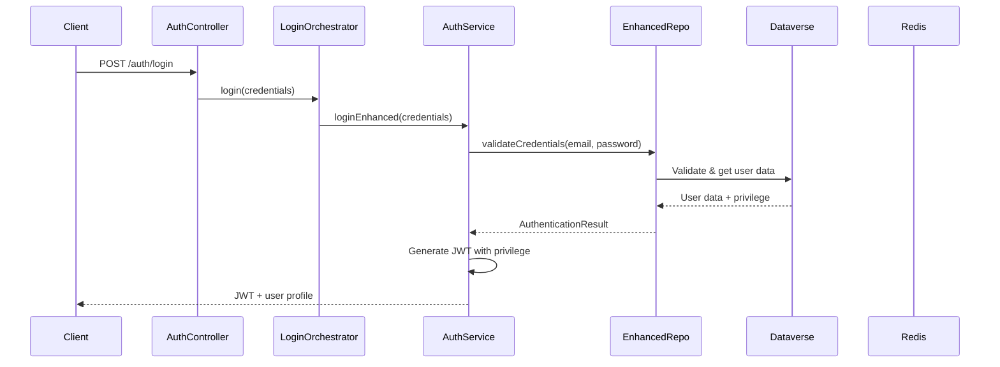

# Authentication System

Unified authentication system for OSOT Dataverse API, supporting both account and affiliate authentication with privilege-based access control from Dataverse.

## 📁 Module Structure

```
auth/
├── auth.controller.ts              # Authentication controller (login/logout)
├── auth.module.ts                  # Authentication module
├── auth.service.ts                 # Authentication and JWT services
├── jwt-auth.guard.ts              # Guard for route protection
├── jwt.strategy.ts                # JWT Passport strategy
├── login-orchestrator.service.ts  # Unified login orchestrator
├── rate-limit.guard.ts            # Rate limiting guard
├── user-lookup.service.ts         # User lookup service
├── interfaces/
│   └── user-repository.interface.ts  # Repository interfaces
├── services/
│   └── enhanced-user-repository.service.ts  # Unified repository
└── types/
    └── user-data.types.ts         # User data types
```

## 🔐 Key Features

### 1. **Unified Authentication**

- Support for **Accounts** and **Affiliates**
- Credential validation via Dataverse
- Intelligent caching with Redis
- Enum-based privilege system

### 2. **Privilege System**

```typescript
enum Privilege {
  OWNER = 1, // Limited access to own data
  ADMIN = 2, // Administrative access
  MAIN = 3, // Full system access
}
```

### 3. **JWT with Blacklist**

- Secure JWT tokens
- Redis blacklist system for global logout
- Automatic token renewal

## 🚀 How to Use

### **Login**

```typescript
POST /auth/login
{
  "osot_email": "user@example.com",
  "osot_password": "password"
}

// Response
{
  "access_token": "eyJhbGciOiJIUzI1...",
  "user": { ... },
  "role": "owner",
  "userType": "account"
}
```

### **Global Logout**

```typescript
POST /auth/logout
Headers: { Authorization: "Bearer TOKEN" }

// Response
{
  "message": "Logout completed successfully."
}
```

### **Route Protection**

```typescript
@Controller('protected')
export class ProtectedController {
  @Get('data')
  @UseGuards(JwtAuthGuard) // Protects the route
  @ApiBearerAuth() // Documents in Swagger
  getData(@User() user: any) {
    return { userId: user.userId, role: user.role };
  }
}
```

## 🔧 Detailed Components

### **AuthController**

Responsible for authentication endpoints:

- `POST /auth/login` - User authentication
- `POST /auth/logout` - Logout with token invalidation

### **AuthService**

Contains business logic:

- `loginEnhanced()` - Main login method
- `blacklistToken()` - Adds token to blacklist
- Privilege → role mapping

### **LoginOrchestratorService**

Orchestrator that delegates to unified system:

- Simplifies authentication calls
- Uses `AuthService.loginEnhanced()`

### **EnhancedUserRepositoryService**

Unified repository that:

- Validates credentials via AccountAuthService/AffiliateAuthService
- Returns complete user data including privilege
- Manages cache via UserLookupService

### **JwtStrategy**

Passport JWT strategy for token validation:

- Extracts and validates tokens
- Returns user data to controllers
- Includes userId, email, role, privilege

### **JwtAuthGuard**

Guard that protects routes:

- Checks Redis blacklist
- Validates JWT tokens
- Blocks access with invalid/expired tokens

## 🏗️ Authentication Flow



## 🔒 Privilege System

### **Access Control**

```typescript
// Controller with privilege verification
private getUserPrivilege(user: Record<string, unknown>): Privilege {
  const privilege = user?.privilege as number;
  return typeof privilege === 'number' ? privilege : Privilege.MAIN;
}

// Example of privilege-based protection
if (userPrivilege === Privilege.OWNER) {
  throw createAppError(ErrorCodes.PERMISSION_DENIED, ...);
}
```

### **Role ↔ Privilege Mapping**

```typescript
// privilege → role
1 (OWNER) → "owner"
2 (ADMIN)  → "admin"
3 (MAIN)   → "main"
```

## 📊 Cache and Performance

### **UserLookupService**

- Intelligent Redis caching
- Login-specific keys: `user:login:email`
- Configurable TTL
- Manual invalidation when needed

### **JWT Blacklist**

- Invalidated tokens stored in Redis
- TTL equals remaining token time
- Automatic verification in JwtAuthGuard

## 🔧 Configuration

### **Environment Variables**

```bash
JWT_SECRET=your-secret-key
REDIS_HOST=localhost
REDIS_PORT=6379
```

### **Swagger Authentication**

```typescript
// main.ts
.addBearerAuth(
  { type: 'http', scheme: 'bearer', bearerFormat: 'JWT' },
  'JWT-auth',
)
```

## 🧪 Testing

### **Account Login**

```bash
curl -X POST http://localhost:3000/auth/login \
  -H "Content-Type: application/json" \
  -d '{"osot_email":"user@example.com","osot_password":"password"}'
```

### **Using Token in Protected Route**

```bash
curl -X GET http://localhost:3000/private/accounts/me \
  -H "Authorization: Bearer YOUR_JWT_TOKEN"
```

### **Logout**

```bash
curl -X POST http://localhost:3000/auth/logout \
  -H "Authorization: Bearer YOUR_JWT_TOKEN"
```

## 🚨 Security

### **Implemented Measures**

- ✅ Rate limiting on login
- ✅ JWT blacklist for secure logout
- ✅ Privilege validation on sensitive routes
- ✅ Secure cache with TTL
- ✅ Security headers
- ✅ Rigorous credential validation

### **Best Practices**

- Always use `@UseGuards(JwtAuthGuard)` on protected routes
- Add `@ApiBearerAuth()` for Swagger documentation
- Implement privilege verification when necessary
- Use logout to invalidate tokens on critical changes

## 📈 Monitoring

### **Available Logs**

- Login attempts (success/failure)
- JWT validation
- Privilege checks
- Cache hits/misses
- Token blacklist operations

### **Important Metrics**

- Login success rate
- Authentication response time
- Redis cache usage
- Blacklisted tokens

## 🔄 Migrations and Updates

### **Legacy Method (DEPRECATED)**

```typescript
// ❌ Don't use
await this.authService.login(loginDto);

// ✅ Use instead
await this.authService.loginEnhanced(loginDto);
```

### **Compatibility**

- Maintains compatibility with existing tokens
- Gradual migration to unified system
- Support for both user types

## 📚 Dependencies

- `@nestjs/jwt` - JWT handling
- `@nestjs/passport` - Authentication strategies
- `passport-jwt` - JWT strategy
- `bcrypt` - Password hashing
- `redis` - Cache and blacklist

## 🤝 Contributing

1. Always test changes with both user types (account/affiliate)
2. Maintain compatibility with privilege system
3. Document new features
4. Add tests for new authentication flows
5. Check Redis cache impact

---

**Version:** 2.0.0 - Unified System
**Last updated:** October 2025
**Maintainer:** OSOT Development Team
