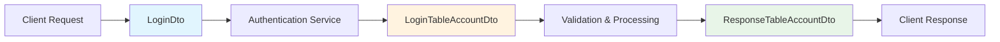

# Login DTOs

Data Transfer Objects (DTOs) for authentication and login operations in the OSOT Dataverse API.

## 📁 Module Structure

```
login/
├── login.dto.ts                    # Input DTO for login requests
├── login-table-account.dto.ts      # Internal DTO for account data processing
└── response-table-account.dto.ts   # Response DTO for safe user data return
```

## 🔐 Overview

This module contains DTOs that handle the data flow for authentication operations, from input validation to secure response formatting. These DTOs ensure type safety, validation, and proper data encapsulation throughout the login process.

## 📋 DTOs Detailed

### **LoginDto**

**File:** `login.dto.ts`
**Purpose:** Validates and structures incoming login requests from clients

```typescript
export class LoginDto {
  @ApiProperty({
    example: 'b.alencar.amaral@gmail.com',
    description: 'User email address',
    name: 'osot_email',
  })
  @IsEmail()
  osot_email: string;

  @ApiProperty({
    example: 'P@ssw0rd!',
    description: 'User password (minimum 8 characters)',
    name: 'osot_password',
  })
  @IsString()
  @MinLength(8)
  osot_password: string;
}
```

**Features:**

- ✅ **Email validation** with `@IsEmail()`
- ✅ **Password length validation** (minimum 8 characters)
- ✅ **Swagger documentation** with examples
- ✅ **Field naming** follows Dataverse convention (`osot_*`)

**Usage:**

```typescript
POST /auth/login
{
  "osot_email": "user@example.com",
  "osot_password": "SecurePassword123!"
}
```

---

### **LoginTableAccountDto**

**File:** `login-table-account.dto.ts`
**Purpose:** Internal representation of account data for authentication processing

```typescript
export class LoginTableAccountDto {
  @ApiProperty({ example: 'osot000123' })
  osot_account_id: string;

  @ApiProperty({ example: 'user@email.com' })
  @IsEmail()
  osot_email: string;

  @ApiProperty({ description: 'The hashed password (internal use only)' })
  @IsString()
  osot_password: string;

  @ApiProperty({ example: 2, description: 'Privilege level for the account' })
  @IsNumber()
  osot_privilege: number;

  @ApiProperty({ enum: AccountStatus })
  @IsEnum(AccountStatus)
  osot_account_status: AccountStatus;

  @ApiProperty({ example: true })
  @IsBoolean()
  osot_active_member: boolean;

  @ApiProperty({ enum: AccountGroup })
  @IsEnum(AccountGroup)
  osot_account_group: AccountGroup;
}
```

**Features:**

- 🔒 **Internal use only** - Contains sensitive data
- 🏷️ **Enum validations** for status and group
- 🔢 **Privilege levels** mapped to numbers
- ✅ **Type safety** with comprehensive validation

**Privilege Levels:**

```typescript
0: Login   // Basic login access
1: Owner   // Limited to own data
2: Admin   // Administrative access
3: Main    // Full system access
```

**Account Status Values:**

- `ACTIVE` - Account is active and usable
- `INACTIVE` - Account is disabled
- `PENDING` - Account awaiting activation

**Account Groups:**

- `THERAPIST` - Therapy professionals
- `ADMIN` - Administrative users
- `OTHER` - General users

---

### **ResponseTableAccountDto**

**File:** `response-table-account.dto.ts`
**Purpose:** Safe representation of user data for API responses (excludes sensitive fields)

```typescript
export class ResponseTableAccountDto {
  @ApiProperty({ example: 'osot000123' })
  osot_account_id: string;

  @ApiProperty({ example: 'Susan' })
  osot_first_name: string;

  @ApiProperty({ example: 'Douglas' })
  osot_last_name: string;

  @ApiProperty({ example: '1990-01-01' })
  osot_date_of_birth: string;

  @ApiProperty({ example: '+1-555-123-4567' })
  osot_mobile_phone: string;

  @ApiProperty({ example: 'user@email.com' })
  osot_email: string;

  @ApiProperty({ enum: AccountGroup })
  osot_account_group: AccountGroup;
}
```

**Features:**

- 🛡️ **Security-first** - Excludes password, privilege, and sensitive data
- 👤 **User profile data** safe for frontend consumption
- 📱 **Frontend-ready** format with proper typing
- 📋 **Complete user info** for profile displays

**Excluded Fields (for security):**

- ❌ `osot_password` - Never exposed
- ❌ `osot_privilege` - Internal access control
- ❌ `osot_account_status` - Internal state management

## 🔄 Data Flow



### **Step-by-Step Process:**

1. **Input Validation** (`LoginDto`)
   - Validates email format
   - Ensures password meets minimum requirements
   - Swagger documentation for API consumers

2. **Internal Processing** (`LoginTableAccountDto`)
   - Maps to complete Dataverse account structure
   - Includes all fields needed for authentication
   - Handles privilege and status validation

3. **Secure Response** (`ResponseTableAccountDto`)
   - Filters out sensitive information
   - Returns only safe user profile data
   - Ready for frontend consumption

## 🛡️ Security Considerations

### **Input Validation**

```typescript
// LoginDto ensures secure input
@IsEmail()           // Validates email format
@MinLength(8)        // Enforces password strength
@IsString()          // Prevents injection attacks
```

### **Data Separation**

```typescript
// Internal processing vs Public response
LoginTableAccountDto  → Contains: password, privilege, status
ResponseTableAccountDto → Contains: profile data only
```

### **Field Exclusion Strategy**

- **Never expose** authentication secrets
- **Filter out** authorization levels
- **Include only** necessary profile information

## 🚀 Usage Examples

### **Login Request**

```typescript
// Client sends LoginDto
const loginRequest: LoginDto = {
  osot_email: 'user@example.com',
  osot_password: 'SecurePassword123!',
};

// API validates and processes
const result = await authService.login(loginRequest);
```

### **Authentication Processing**

```typescript
// Internal service uses LoginTableAccountDto
const accountData: LoginTableAccountDto = {
  osot_account_id: 'osot000123',
  osot_email: 'user@example.com',
  osot_password: '$2b$10$hashedpassword...',
  osot_privilege: 1, // OWNER level
  osot_account_status: AccountStatus.ACTIVE,
  osot_active_member: true,
  osot_account_group: AccountGroup.THERAPIST,
};
```

### **Safe Response**

```typescript
// Client receives ResponseTableAccountDto
const userProfile: ResponseTableAccountDto = {
  osot_account_id: 'osot000123',
  osot_first_name: 'Susan',
  osot_last_name: 'Douglas',
  osot_date_of_birth: '1990-01-01',
  osot_mobile_phone: '+1-555-123-4567',
  osot_email: 'user@example.com',
  osot_account_group: AccountGroup.THERAPIST,
  // Note: No password, privilege, or status exposed
};
```

## 🔧 Integration Points

### **Authentication Service**

```typescript
@Injectable()
export class AuthService {
  async login(loginDto: LoginDto): Promise<{
    access_token: string;
    user: ResponseTableAccountDto;
  }> {
    // Process with LoginTableAccountDto internally
    // Return safe ResponseTableAccountDto to client
  }
}
```

### **Controller Usage**

```typescript
@Controller('auth')
export class AuthController {
  @Post('login')
  @ApiBody({ type: LoginDto })
  @ApiResponse({ type: ResponseTableAccountDto })
  async login(@Body() loginDto: LoginDto) {
    return this.authService.login(loginDto);
  }
}
```

### **Swagger Documentation**

All DTOs include comprehensive Swagger decorators for:

- 📖 **API documentation** generation
- 🔍 **Request/response examples**
- ✅ **Validation rules** display
- 🏷️ **Field descriptions** and constraints

## 📊 Validation Rules Summary

| DTO                    | Field                 | Validation      | Purpose                      |
| ---------------------- | --------------------- | --------------- | ---------------------------- |
| `LoginDto`             | `osot_email`          | `@IsEmail()`    | Email format validation      |
| `LoginDto`             | `osot_password`       | `@MinLength(8)` | Minimum security requirement |
| `LoginTableAccountDto` | `osot_privilege`      | `@IsNumber()`   | Numeric privilege level      |
| `LoginTableAccountDto` | `osot_account_status` | `@IsEnum()`     | Valid status values          |
| `LoginTableAccountDto` | `osot_account_group`  | `@IsEnum()`     | Valid group classification   |

## 🧪 Testing

### **Unit Test Examples**

```typescript
describe('LoginDto', () => {
  it('should validate valid email', () => {
    const dto = new LoginDto();
    dto.osot_email = 'user@example.com';
    dto.osot_password = 'Password123!';
    // Validation should pass
  });

  it('should reject invalid email', () => {
    const dto = new LoginDto();
    dto.osot_email = 'invalid-email';
    dto.osot_password = 'Password123!';
    // Validation should fail
  });
});
```

### **Integration Testing**

```typescript
describe('Login Flow', () => {
  it('should process complete login flow', async () => {
    const loginDto: LoginDto = {
      /* valid data */
    };
    const result = await authService.login(loginDto);

    expect(result.user).toBeInstanceOf(ResponseTableAccountDto);
    expect(result.user.osot_password).toBeUndefined(); // Security check
  });
});
```

## 🤝 Contributing

### **Adding New Fields**

1. **Update internal DTO** first (`LoginTableAccountDto`)
2. **Consider security implications** before adding to response DTO
3. **Add appropriate validations** with decorators
4. **Update Swagger documentation** with examples

### **Security Guidelines**

- ❌ **Never expose** passwords or hashes in response DTOs
- ❌ **Avoid exposing** privilege levels to frontend
- ✅ **Always validate** input with appropriate decorators
- ✅ **Use enums** for controlled value sets

### **Naming Conventions**

- Use `osot_` prefix for Dataverse field mapping
- Follow camelCase for TypeScript properties
- Use descriptive names that match Dataverse schema

---

**Version:** 1.0.0
**Last updated:** October 2025
**Related modules:** `auth/`, `common/enums/`
