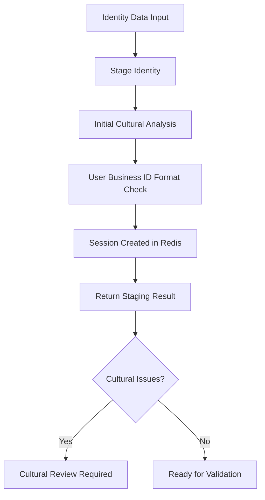
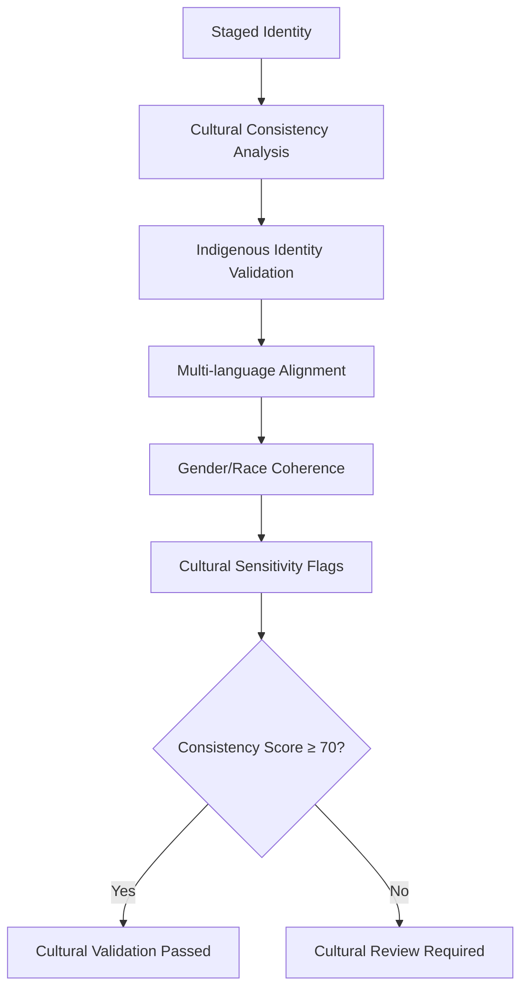
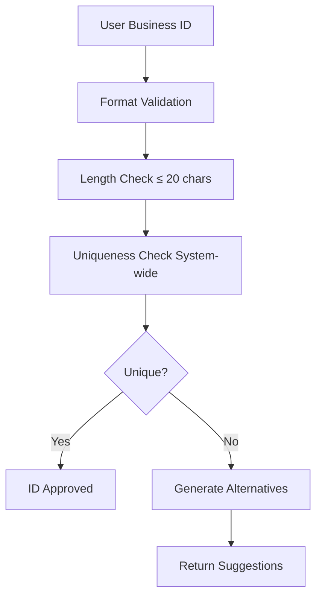
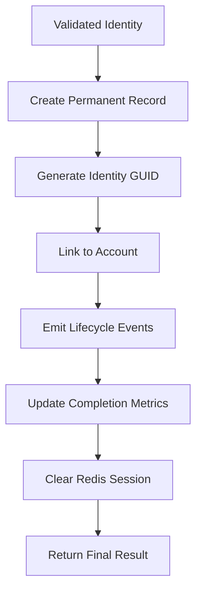

# Identity Orchestrator Specifications

## 🎯 Purpose & Strategic Vision

Este diretório contém **especificações técnicas completas** e **contratos de interface** para a futura implementação do IdentityOrchestrator - um sistema avançado de orquestração de workflows de identidade com sensibilidade cultural e suporte multi-linguístico.

### ⚠️ **IMPORTANTE: Framework de Especificações Técnicas**

**Esta NÃO é uma implementação funcional**, mas sim um **mapa arquitetural abrangente** que define:

- ✅ **Contratos de Interface**: APIs e assinaturas de métodos precisas
- ✅ **Estruturas de Dados**: DTOs padronizados para sessões e resultados
- ✅ **Padrões de Erro**: Error handling centralizado com `createAppError`
- ✅ **Fluxos de Workflow**: Demonstrações de coordenação de sessões
- ✅ **Integração Cultural**: Protocolos de sensibilidade indígena e diversidade

## 📁 Arquitetura do Diretório

```
orchestrator/
├── 📋 interfaces/           # Contratos de Orquestração
│   └── identity-orchestrator.interface.ts  # Interface IdentityOrchestrator completa
├── 📦 dto/                  # Estruturas de Dados Padronizadas
│   ├── identity-session.dto.ts        # Gestão de sessões Redis
│   ├── workflow-results.dto.ts        # Resultados de workflow padronizados
│   └── index.ts                       # Exports centralizados de DTOs
├── 🔧 services/             # Implementações Demonstrativas
│   └── identity-orchestrator-demo.service.ts  # Padrões de gestão de sessão
├── 📋 index.ts              # Exports centralizados do módulo
└── 📖 README.md            # Este documento (especificação completa)
```

## 🏗️ Componentes Principais

### 1. **Interface de Orquestração** (`interfaces/identity-orchestrator.interface.ts`)

**Contrato Principal**: Define todas as operações necessárias para orquestração de identidade:

```typescript
interface IdentityOrchestrator {
  // Staging Operations - Preparação para registro
  stageIdentity(
    data: IdentityCreateDto,
    accountGuid: string,
    options?: StagingOptions,
  ): Promise<IdentityStagingResult>;
  getStagedIdentity(sessionId: string): Promise<IdentitySessionState | null>;
  updateStagedIdentity(
    sessionId: string,
    updates: Partial<IdentityCreateDto>,
  ): Promise<IdentityStagingResult>;

  // Cultural Validation - Validação cultural sensível
  validateStagedIdentity(
    sessionId: string,
    options?: ValidationOptions,
  ): Promise<CulturalValidationResult>;
  analyzeCulturalConsistency(
    sessionId: string,
  ): Promise<CulturalConsistencyAnalysisResult>;
  analyzeMultiLanguagePreferences(
    sessionId: string,
  ): Promise<MultiLanguagePreferenceAnalysis>;

  // Business Validation - Validação de regras de negócio
  validateUserBusinessId(
    sessionId: string,
  ): Promise<UserBusinessIdValidationInsights>;

  // Persistence Operations - Persistência final
  persistValidatedIdentity(
    sessionId: string,
  ): Promise<IdentityPersistenceResult>;

  // Bulk Operations - Operações em lote
  stageBulkIdentities(
    identitiesData: IdentityCreateDto[],
    accountGuid: string,
  ): Promise<BulkIdentityProgress>;
  processBulkValidation(batchId: string): Promise<BulkIdentityProgress>;
}
```

**Features Culturais Avançadas**:

- 🏛️ **Detecção de Identidade Indígena**: Reconhecimento automático de marcadores culturais
- 🌍 **Análise Multi-linguística**: Validação de preferências de idioma e consistência cultural
- 📊 **Analytics Demográficos**: Análise de distribuição racial, de gênero e diversidade
- 🔍 **Consistência Cultural**: Validação lógica entre campos de identidade cultural

### 2. **DTOs de Sessão** (`dto/identity-session.dto.ts`)

**Gestão de Estado Redis**: Estruturas para armazenamento temporário durante workflows:

```typescript
export class IdentitySessionDto {
  sessionId: string;
  status:
    | 'staged'
    | 'validating'
    | 'cultural_analysis'
    | 'ready_for_creation'
    | 'failed';

  // Core Identity Data (matching IdentityCreateDto)
  osot_user_business_id: string;
  osot_chosen_name?: string;
  osot_language: Language[];
  osot_gender?: Gender;
  osot_race?: Race;
  osot_indigenous?: boolean;
  osot_indigenous_detail?: IndigenousDetail;
  osot_disability?: boolean;
  osot_access_modifiers?: AccessModifier;
  osot_privilege?: Privilege;

  // Orchestration-specific analysis
  culturalAnalysis: CulturalConsistencyAnalysisDto;
  completeness: IdentityCompletenessDto;
  metadata: SessionMetadataDto;
  validationErrors: string[];
  warnings: string[];
  nextAction:
    | 'validate_business_id'
    | 'analyze_cultural_consistency'
    | 'create_identity';
}
```

**Análise Cultural Integrada**:

```typescript
export class CulturalConsistencyAnalysisDto {
  consistencyScore: number; // 0-100
  issues: string[];
  recommendations: string[];
  indigenousConsistency: boolean;
  languageCultureAlignment: boolean;
}
```

### 3. **DTOs de Resultados** (`dto/workflow-results.dto.ts`)

**Respostas Padronizadas**: Estruturas consistentes para todas as operações:

```typescript
export class IdentityStagingResultDto extends BaseWorkflowResultDto {
  sessionId?: string;
  status: 'staged' | 'validating' | 'ready_for_creation' | 'failed';
  userBusinessId?: string;
  nextAction:
    | 'validate_business_id'
    | 'analyze_cultural_consistency'
    | 'create_identity';
  warnings: string[];
  initialCompleteness?: number;
}

export class CulturalValidationResultDto extends BaseWorkflowResultDto {
  sessionId: string;
  consistencyScore: number; // 0-100
  validationPassed: boolean;
  issues: string[];
  recommendations: string[];
  indigenousConsistency: boolean;
  languageCultureAlignment: boolean;
}

export class IdentityCreationResultDto extends BaseWorkflowResultDto {
  sessionId: string;
  identityId?: string;
  identityData?: IdentityResponseDto;
  finalCompleteness: number;
  finalConsistencyScore: number;
  registeredLanguages: number[];
  culturalIdentityFlags: {
    hasGender: boolean;
    hasRace: boolean;
    hasIndigenousStatus: boolean;
    hasDisabilityStatus: boolean;
  };
}
```

### 4. **Serviço Demonstrativo** (`services/identity-orchestrator-demo.service.ts`)

**Implementação de Referência**: Demonstra padrões de coordenação e gestão de sessão:

```typescript
@Injectable()
export class IdentityOrchestratorDemoService
  implements Partial<IdentityOrchestrator> {
  // Demonstra padrões de:
  // - Gestão de sessões Redis com contexto cultural
  // - Coordenação de workflows step-by-step
  // - Error handling padronizado com createAppError
  // - Análise cultural e validação de consistência
  // - Multi-language preference detection
  // - User Business ID validation patterns
}
```

**Error Handling Padronizado**:

```typescript
// Padrão aplicado em toda a implementação
throw createAppError(
  ErrorCodes.NOT_FOUND,
  { sessionId },
  404,
  'Identity session not found or expired',
);
```

## 🌍 Recursos de Sensibilidade Cultural

### 🏛️ **Protocolos de Identidade Indígena**

**Detecção Avançada**:

```typescript
interface CulturalConsistencyAnalysisResult {
  indigenousIdentityMarkers: {
    detected: boolean;
    confidence: number; // 0-100
    traditionalNames: string[];
    culturalTerminology: string[];
  };
  culturalFlags: string[];
  sensitivityWarnings: string[];
}
```

**Configuração de Sensibilidade**:

```typescript
export const CULTURAL_SENSITIVITY_CONFIG = {
  INDIGENOUS_IDENTITY_MARKERS: [
    'aboriginal',
    'indigenous',
    'first nation',
    'métis',
    'inuit',
    'native',
    'tribal',
  ],
  TRADITIONAL_NAME_PATTERNS: [
    /^[A-Z][a-z]+ [A-Z][a-z]+-[A-Z][a-z]+$/, // Hyphenated surnames
    /^[A-Z][a-z]+\s+(of|from|from the|of the)\s+[A-Z]/, // Place names
  ],
  CULTURAL_PROTOCOL_REQUIRED_FIELDS: [
    'osot_indigenous',
    'osot_indigenous_detail',
    'osot_indigenous_detail_other',
  ],
};
```

### 🌍 **Suporte Multi-linguístico Avançado**

**Análise de Preferências Linguísticas**:

```typescript
interface MultiLanguagePreferenceAnalysis {
  detectedLanguages: string[];
  primaryLanguageConfidence: number; // 0-100
  multilingualIndicators: {
    hasMultipleLanguages: boolean;
    linguisticDiversity: number;
    culturalLinguisticAlignment: boolean;
  };
  culturalLinguisticContext: {
    indigenousLanguagePresent: boolean;
    heritageLanguageMaintenance: boolean;
    languageRevitalizationRelevant: boolean;
  };
}
```

**Configuração Multi-língua**:

```typescript
export const MULTI_LANGUAGE_CONFIG = {
  OFFICIAL_LANGUAGES: ['english', 'french'],
  INDIGENOUS_LANGUAGES_CANADA: [
    'cree',
    'inuktitut',
    'ojibwe',
    'dene',
    'mikmaq',
    'blackfoot',
    'mohawk',
  ],
  HERITAGE_LANGUAGES_COMMON: [
    'mandarin',
    'cantonese',
    'punjabi',
    'spanish',
    'arabic',
    'tagalog',
  ],
  LANGUAGE_DIVERSITY_THRESHOLD: 3,
};
```

## 🔄 Fluxos de Workflow Suportados

### 1. **Staging de Identidade** (Preparação para Registro)



**Características**:

- ✅ **Storage Temporário**: Redis com TTL configurável (padrão: 2 horas)
- ✅ **Análise Cultural Inicial**: Detecção de marcadores culturais e indígenas
- ✅ **Validação de Formato**: User Business ID (máximo 20 caracteres)
- ✅ **Tracking de Metadata**: IP, User Agent, contexto de registro

### 2. **Validação Cultural Abrangente**



**Análises Realizadas**:

- 🏛️ **Indigenous Status Consistency**: Validação lógica entre `osot_indigenous` e `osot_indigenous_detail`
- 🌍 **Language-Culture Alignment**: Coerência entre idiomas e marcadores culturais
- 👥 **Demographic Coherence**: Consistência entre gênero, raça e contexto cultural
- 🔍 **Sensitivity Detection**: Identificação automática de termos culturalmente sensíveis

### 3. **User Business ID Validation**



**Validações Aplicadas**:

- ✅ **Format Compliance**: Padrões de caracteres e estrutura
- ✅ **Length Enforcement**: Máximo 20 caracteres
- ✅ **System-wide Uniqueness**: Verificação em toda a base de dados
- ✅ **Auto-generation**: Sugestões usando padrão `osot-id-{timestamp}`

### 4. **Persistência com Audit Trail**



**Eventos Gerados**:

- 📋 `IdentityCreated`: Nova identidade estabelecida
- 🔄 `IdentityUpdated`: Modificações de identidade
- 🏛️ `CulturalConsistencyChanged`: Mudanças de alinhamento cultural
- 🌍 `LanguagePreferencesUpdated`: Atualizações linguísticas

## 📊 Analytics e Relatórios

### 🔍 **Demographic Insights**

```typescript
interface BulkIdentityProgress {
  batchId: string;
  demographicSummary: {
    languageDistribution: Record<string, number>;
    genderDistribution: Record<string, number>;
    raceDistribution: Record<string, number>;
    indigenousCount: number;
    disabilityCount: number;
    averageCompleteness: number;
    averageConsistencyScore: number;
  };
}
```

### 📈 **Métricas de Completeness**

- **Minimal** (0-40%): Campos básicos apenas
- **Basic** (41-65%): Informações essenciais completas
- **Comprehensive** (66-85%): Perfil detalhado com contexto cultural
- **Complete** (86-100%): Todos os campos opcionais preenchidos

### 🏛️ **Cultural Compliance Scoring**

- **High Consistency** (85-100): Alinhamento cultural excelente
- **Good Consistency** (70-84): Alinhamento cultural adequado
- **Moderate Consistency** (50-69): Algumas inconsistências menores
- **Low Consistency** (0-49): Requer revisão cultural

## 🔧 Padrões de Implementação

### 📋 **Error Handling Centralizado**

**Todos os serviços seguem o padrão**:

```typescript
import { createAppError } from '../../../../../common/errors/error.factory';
import { ErrorCodes } from '../../../../../common/errors/error-codes';

// Uso consistente
throw createAppError(
  ErrorCodes.VALIDATION_ERROR,
  { sessionId, originalError: error.message },
  400,
  'Cultural validation failed',
);
```

### 🎯 **Enum Usage Centralizado**

**Imports padronizados**:

```typescript
import {
  Language,
  Gender,
  Race,
  IndigenousDetail,
  AccessModifier,
  Privilege,
} from '../../../../../common/enums';
```

### ⚡ **Session Management Pattern**

**Redis Storage Otimizado**:

```typescript
interface IdentitySession {
  sessionId: string;
  accountGuid: string;
  currentStep: 'staging' | 'cultural_validation' | 'persistence' | 'complete';
  originalData: IdentityCreateDto;
  culturalAnalysis: CulturalAnalysisResult;
  progress: StepTrackingObject;
  statusHistory: HistoryEntry[];
  expiresAt: Date;
}
```

## 🚀 Roadmap de Implementação

### Fase 1: **Foundation Setup** (Sprint 1-2)

- [ ] Implementar `IdentityOrchestrator` interface completa
- [ ] Setup Redis service para session management
- [ ] Implementar DTOs de sessão e workflow results
- [ ] Configurar error handling centralizado

### Fase 2: **Core Workflows** (Sprint 3-4)

- [ ] Implementar identity staging com cultural analysis
- [ ] Desenvolver cultural validation engine
- [ ] Criar User Business ID validation service
- [ ] Implementar persistência com audit trail

### Fase 3: **Advanced Features** (Sprint 5-6)

- [ ] Multi-language preference analysis
- [ ] Indigenous identity protocol compliance
- [ ] Bulk processing com demographic analytics
- [ ] Performance optimization e caching

### Fase 4: **Integration & Testing** (Sprint 7-8)

- [ ] Integração com Identity Module services
- [ ] Comprehensive testing suite
- [ ] Documentation e training materials
- [ ] Performance benchmarking

## 🔗 Integração com Identity Module

### **Services Disponíveis para Orquestração**:

```typescript
// Disponível via DI
constructor(
  private readonly identityCrud: IdentityCrudService,           // CRUD operations
  private readonly identityBusiness: IdentityBusinessRuleService, // Validation
  private readonly identityLookup: IdentityLookupService,       // Analytics
  private readonly identityEvents: IdentityEventService,       // Events
  private readonly redisService: RedisService,                 // Sessions
) {}
```

### **Workflow Integration Points**:

1. **Staging**: Use `IdentityBusinessRuleService.validateForCreation()`
2. **Cultural Analysis**: Custom orchestrator logic + business rules
3. **User Business ID**: Use `IdentityBusinessRuleService.checkUserBusinessIdUniqueness()`
4. **Persistence**: Use `IdentityCrudService.create()` + `IdentityEventService.emit()`
5. **Analytics**: Use `IdentityLookupService.getIdentityStatistics()`

## ⚠️ **Considerações de Segurança Cultural**

### 🏛️ **Protocolos Indígenas**

- **Consent First**: Sempre solicitar consentimento explícito para dados culturais sensíveis
- **Cultural Review**: Processos de revisão para identidades indígenas complexas
- **Traditional Names**: Preservação de nomes tradicionais e terminologia cultural
- **Community Protocols**: Respeito aos protocolos comunitários específicos

### 🔒 **Privacy by Design**

- **Access Modifiers**: Padrão Private para proteção máxima
- **Data Minimization**: Coleta apenas de dados culturais necessários
- **Audit Trail**: Logging completo de acesso a dados culturais sensíveis
- **Right to Erasure**: Suporte para remoção de dados culturais

## 📚 **Como Usar Este Framework**

### Para **Implementar o Orchestrator Real**:

1. **📋 Study the Interface**: Implemente `IdentityOrchestrator` definida em `interfaces/`
2. **📦 Use os DTOs**: Utilize as estruturas de dados definidas em `dto/`
3. **🔧 Reference Demo Service**: Consulte padrões de sessão em `services/`
4. **📖 Follow Specifications**: Leia documentação dos controllers em `../controllers/`

### Para **Integrar com Identity Services**:

- ✅ **IdentityCrudService** - Operações CRUD básicas
- ✅ **IdentityBusinessRuleService** - Validações e consistência cultural
- ✅ **IdentityLookupService** - Queries especializadas e analytics
- ✅ **IdentityEventService** - Lifecycle events e audit trail

### Para **Desenvolvimento de Features**:

- 🔍 **Cultural Analysis**: Use `CulturalConsistencyAnalysisDto` como template
- 🌍 **Multi-language**: Implemente `MultiLanguagePreferenceAnalysis`
- 📊 **Analytics**: Use `BulkIdentityProgress` para demographic insights
- 🔒 **Security**: Siga padrões de `createAppError` e enum centralization

## 🎯 **Valor Estratégico**

Este orchestrator framework fornece:

1. **🏗️ Arquitetura Sólida**: Padrões estabelecidos para implementação futura
2. **🌍 Cultural Sensitivity**: Protocolos avançados para diversidade e inclusão
3. **📋 Consistency**: Error handling e data structures padronizados
4. **⚡ Performance**: Session management otimizado para workflows complexos
5. **📊 Analytics**: Insights demográficos e de completeness abrangentes
6. **🔒 Security**: Privacy by design com cultural sensitivity
7. **🚀 Scalability**: Suporte para bulk operations e high throughput
8. **🔧 Maintainability**: Código bem documentado e testável

**Este framework serve como blueprint definitivo para o futuro IdentityOrchestrator real!** 🎉
